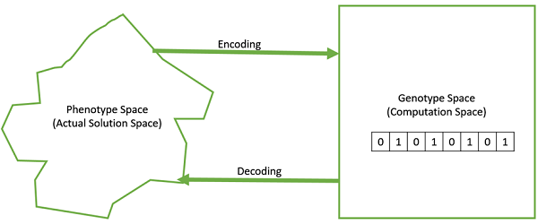
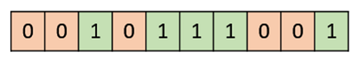
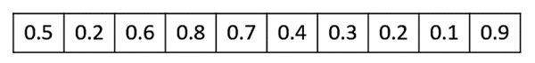
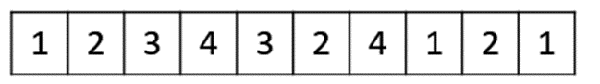
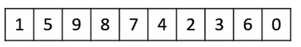
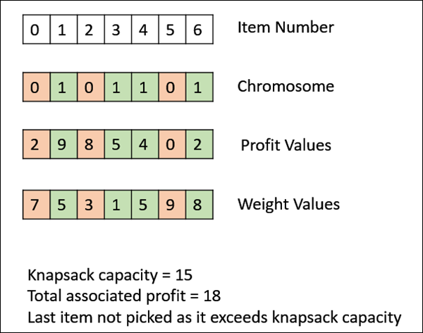
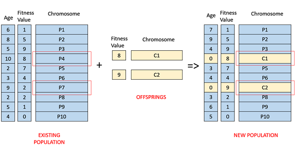
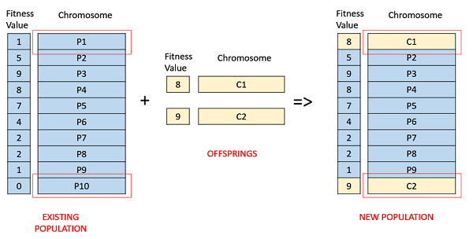

# Genetic algorithms

Genetic Algorithm (GA) is a search-based optimization technique based on the principles of Genetics and Natural Selection. 
It is frequently used to find optimal or near-optimal solutions to difficult problems which otherwise would take a lifetime
 o solve. It is frequently used to solve optimization problems, in research, and in machine learning.

### Introduction to optimization

Optimization is the process of making something better. 

Optimization refers to finding the values of inputs in such a way that we get the “best” output values. The definition 
of “best” varies from problem to problem, but in mathematical terms, it refers to maximizing or minimizing one or more 
objective functions, by varying the input parameters.

The set of all possible solutions or values which the inputs can take make up the search space. In this search space, 
lies a point or a set of points which gives the optimal solution. The aim of optimization is to find that point or set 
of points in the search space.

### Why genetic algorithms?

Nature has always been a great source of inspiration to all mankind. Genetic Algorithms (GAs) are search based algorithms 
based on the concepts of natural selection and genetics. GAs are a subset of a much larger branch of computation known as 
Evolutionary Computation.

GAs were developed by John Holland and his students and colleagues at the University of Michigan, most notably David E. Goldberg 
and has since been tried on various optimization problems with a high degree of success.

In GAs, we have a pool or a population of possible solutions to the given problem. These solutions then undergo recombination 
and mutation (like in natural genetics), producing new children, and the process is repeated over various generations. 
Each individual (or candidate solution) is assigned a fitness value (based on its objective function value) and the fitter 
individuals are given a higher chance to mate and yield more “fitter” individuals. This is in line with the Darwinian 
Theory of “Survival of the Fittest”.

In this way we keep “evolving” better individuals or solutions over generations, till we reach a stopping criterion.

Genetic Algorithms are sufficiently randomized in nature, but they perform much better than random local search (in which 
we just try various random solutions, keeping track of the best so far), as they exploit historical information as well.

### Advantages of GA
GAs have various advantages which have made them immensely popular. These include −

- Does not require any derivative information (which may not be available for many real-world problems).
- Is faster and more efficient as compared to the traditional methods.
- Has very good parallel capabilities.
- Optimizes both continuous and discrete functions and also multi-objective problems.
- Provides a list of “good” solutions and not just a single solution.
- Always gets an answer to the problem, which gets better over the time.
- Useful when the search space is very large and there are a large number of parameters involved.

### Limitations of GA

Like any technique, GAs also suffer from a few limitations. These include −
- GAs are not suited for all problems, especially problems which are simple and for which derivative information is available.
- Fitness value is calculated repeatedly which might be computationally expensive for some problems.
- Being stochastic, there are no guarantees on the optimality or the quality of the solution.
- If not implemented properly, the GA may not converge to the optimal solution.

### Motivation

Genetic Algorithms have the ability to deliver a “good-enough” solution “fast-enough”. This makes genetic algorithms attractive 
for use in solving optimization problems. The reasons why GAs are needed are as follows −

- Solving Difficult Problems: In computer science, there is a large set of problems, which are NP-Hard. What this essentially 
means is that, even the most powerful computing systems take a very long time (even years!) to solve that problem. 
In such a scenario, GAs prove to be an efficient tool to provide usable near-optimal solutions in a short amount of time.

- Failure of Gradient Based Methods
Traditional calculus based methods work by starting at a random point and by moving in the direction of the gradient, till 
we reach the top of the hill. This technique is efficient and works very well for single-peaked objective functions like 
the cost function in linear regression. But, in most real-world situations, we have a very complex problem called as 
landscapes, which are made of many peaks and many valleys, which causes such methods to fail, as they suffer from an 
inherent tendency of getting stuck at the local optima.

Some difficult problems like the Travelling Salesperson Problem (TSP), have real-world applications like path finding and 
VLSI Design. Now imagine that you are using your GPS Navigation system, and it takes a few minutes (or even a few hours) 
to compute the “optimal” path from the source to destination. Delay in such real world applications is not acceptable 
and therefore a “good-enough” solution, which is delivered “fast” is what is required.

# Fundamentals

Some basic terminology

Population − It is a subset of all the possible (encoded) solutions to the given problem. The population for a GA is analogous to the population for human beings except that instead of human beings, we have Candidate Solutions representing human beings.

Chromosomes − A chromosome is one such solution to the given problem.

Gene − A gene is one element position of a chromosome.

Allele − It is the value a gene takes for a particular chromosome.


Genotype − Genotype is the population in the computation space. In the computation space, the solutions are represented in a way which can be easily understood and manipulated using a computing system.

Phenotype − Phenotype is the population in the actual real world solution space in which solutions are represented in a way they are represented in real world situations.

Decoding and Encoding − For simple problems, the phenotype and genotype spaces are the same. However, in most of the cases, the phenotype and genotype spaces are different. 
Decoding is a process of transforming a solution from the genotype to the phenotype space, while encoding is a process of transforming from the phenotype to genotype space. 
Decoding should be fast as it is carried out repeatedly in a GA during the fitness value calculation.

For example, consider the 0/1 Knapsack Problem. The Phenotype space consists of solutions which just contain the item numbers of the items to be picked.

However, in the genotype space it can be represented as a binary string of length n (where n is the number of items). 
A 0 at position x represents that xth item is picked while a 1 represents the reverse. This is a case where genotype and phenotype spaces are different.



Fitness Function − A fitness function simply defined is a function which takes the solution as input and produces the suitability of the solution as the output. In some cases, the fitness function and the objective function may be the same, while in others it might be different based on the problem.

Genetic Operators − These alter the genetic composition of the offspring. These include crossover, mutation, selection, etc.

### Basic structures

The basic structure of a GA is as follows −

We start with an initial population (which may be generated at random or seeded by other heuristics), select parents from 
this population for mating. Apply crossover and mutation operators on the parents to generate new off-springs. And finally 
these off-springs replace the existing individuals in the population and the process repeats. In this way genetic algorithms 
actually try to mimic the human evolution to some extent.

A generalized pseudo-code for a GA is explained in the following program −

```
GA()
   initialize population
   find fitness of population
   
   while (termination criteria is reached) do
      parent selection
      crossover with probability pc
      mutation with probability pm
      decode and fitness calculation
      survivor selection
      find best
   return best
```

### Genotype representation

One of the most important decisions to make while implementing a genetic algorithm is deciding the representation that 
we will use to represent our solutions. It has been observed that improper representation can lead to poor performance of the GA.

Therefore, choosing a proper representation, having a proper definition of the mappings between the phenotype and genotype 
spaces is essential for the success of a GA.

In this section, we present some of the most commonly used representations for genetic algorithms. However, representation 
is highly problem specific and the reader might find that another representation or a mix of the representations mentioned 
here might suit his/her problem better.

- Binary representation

This is one of the simplest and most widely used representation in GAs. In this type of representation the genotype consists of bit strings.

For some problems when the solution space consists of Boolean decision variables – yes or no, the binary representation is natural. 
Take for example the 0/1 Knapsack Problem. If there are n items, we can represent a solution by a binary string of n elements, 
where the xth element tells whether the item x is picked (1) or not (0).



For other problems, specifically those dealing with numbers, we can represent the numbers with their binary representation. 
The problem with this kind of encoding is that different bits have different significance and therefore mutation and crossover 
operators can have undesired consequences. This can be resolved to some extent by using Gray Coding, as a change in one bit does 
not have a massive effect on the solution.

- Real Valued Representation

For problems where we want to define the genes using continuous rather than discrete variables, the real valued 
representation is the most natural. The precision of these real valued or floating point numbers is however limited to the computer.



- Integer Representation

For discrete valued genes, we cannot always limit the solution space to binary ‘yes’ or ‘no’. For example, if we want 
to encode the four distances – North, South, East and West, we can encode them as {0,1,2,3}. In such cases, integer representation is desirable.



- Permutation Representation

In many problems, the solution is represented by an order of elements. In such cases permutation representation is the most suited.

A classic example of this representation is the travelling salesman problem (TSP). In this the salesman has to take a tour 
of all the cities, visiting each city exactly once and come back to the starting city. The total distance of the tour 
has to be minimized. The solution to this TSP is naturally an ordering or permutation of all the cities and therefore using 
a permutation representation makes sense for this problem.



### Population

Population is a subset of solutions in the current generation. It can also be defined as a set of chromosomes. There are 
several things to be kept in mind when dealing with GA population −

- The diversity of the population should be maintained otherwise it might lead to premature convergence.

- The population size should not be kept very large as it can cause a GA to slow down, while a smaller population might 
not be enough for a good mating pool. Therefore, an optimal population size needs to be decided by trial and error.

The population is usually defined as a two dimensional array of – size population, size x, chromosome size.

There are two primary methods to initialize a population in a GA. They are −

- Random Initialization − Populate the initial population with completely random solutions.

- Heuristic initialization − Populate the initial population using a known heuristic for the problem.

It has been observed that the entire population should not be initialized using a heuristic, as it can result in the population 
having similar solutions and very little diversity. It has been experimentally observed that the random solutions are 
the ones to drive the population to optimality. Therefore, with heuristic initialization, we just seed the population 
with a couple of good solutions, filling up the rest with random solutions rather than filling the entire population with heuristic based solutions.

It has also been observed that heuristic initialization in some cases, only effects the initial fitness of the population, 
but in the end, it is the diversity of the solutions which lead to optimality.

There are two population models widely in use −

- Steady State: In steady state GA, we generate one or two off-springs in each iteration and they replace one or two 
individuals from the population. A steady state GA is also known as Incremental GA.

- Generational: In a generational model, we generate ‘n’ off-springs, where n is the population size, and the entire population 
is replaced by the new one at the end of the iteration.

### Fitness Function

The fitness function simply defined is a function which takes a candidate solution to the problem as input and produces 
as output how “fit” our how “good” the solution is with respect to the problem in consideration.

Calculation of fitness value is done repeatedly in a GA and therefore it should be sufficiently fast. A slow computation 
of the fitness value can adversely affect a GA and make it exceptionally slow.

In most cases the fitness function and the objective function are the same as the objective is to either maximize or 
minimize the given objective function. However, for more complex problems with multiple objectives and constraints, an 
Algorithm Designer might choose to have a different fitness function.

A fitness function should possess the following characteristics −

- The fitness function should be sufficiently fast to compute.

- It must quantitatively measure how fit a given solution is or how fit individuals can be produced from the given solution.

In some cases, calculating the fitness function directly might not be possible due to the inherent complexities of the 
problem at hand. In such cases, we do fitness approximation to suit our needs.

The following image shows the fitness calculation for a solution of the 0/1 Knapsack. It is a simple fitness function which 
just sums the profit values of the items being picked (which have a 1), scanning the elements from left to right till the knapsack is full.



### Parent selection

Parent Selection is the process of selecting parents which mate and recombine to create off-springs for the next generation. 
Parent selection is very crucial to the convergence rate of the GA as good parents drive individuals to a better and fitter solutions.

However, care should be taken to prevent one extremely fit solution from taking over the entire population in a few generations, 
as this leads to the solutions being close to one another in the solution space thereby leading to a loss of diversity. 
Maintaining good diversity in the population is extremely crucial for the success of a GA. This taking up of the entire 
population by one extremely fit solution is known as premature convergence and is an undesirable condition in a GA.

Fitness Proportionate Selection is one of the most popular ways of parent selection. In this every individual can become 
a parent with a probability which is proportional to its fitness. Therefore, fitter individuals have a higher chance of 
mating and propagating their features to the next generation. Therefore, such a selection strategy applies a selection 
pressure to the more fit individuals in the population, evolving better individuals over time.

### Crossover

The crossover operator is analogous to reproduction and biological crossover. In this more than one parent is selected 
and one or more off-springs are produced using the genetic material of the parents. Crossover 
is usually applied in a GA with a high probability – pc.

One Point Crossover - In this one-point crossover, a random crossover point is selected and the tails of its two parents are swapped to get new off-springs.


Multi Point Crossover - Multi point crossover is a generalization of the one-point crossover wherein alternating segments are swapped to get new off-springs.


Uniform Crossover - In a uniform crossover, we don’t divide the chromosome into segments, rather we treat each gene separately. 
In this, we essentially flip a coin for each chromosome to decide whether or not it’ll be included in the off-spring. We can 
also bias the coin to one parent, to have more genetic material in the child from that parent.


Whole Arithmetic Recombination - This is commonly used for integer representations and works by taking the weighted average 
of the two parents by using the following formulae −
                                 
Child1 = α.x + (1-α).y
Child2 = α.x + (1-α).y

Obviously, if α = 0.5, then both the children will be identical as shown in the following image.


Davis’ Order Crossover (OX1) - OX1 is used for permutation based crossovers with the intention of transmitting information 
about relative ordering to the off-springs. It works as follows −

- Create two random crossover points in the parent and copy the segment between them from the first parent to the first offspring.

- Now, starting from the second crossover point in the second parent, copy the remaining unused numbers from the second 
parent to the first child, wrapping around the list.

- Repeat for the second child with the parent’s role reversed.


### Mutation

In simple terms, mutation may be defined as a small random tweak in the chromosome, to get a new solution. It is used to 
maintain and introduce diversity in the genetic population and is usually applied with a low probability – pm. If the 
probability is very high, the GA gets reduced to a random search.

Mutation is the part of the GA which is related to the “exploration” of the search space. It has been observed that mutation 
is essential to the convergence of the GA while crossover is not.

Bit Flip Mutation - In this bit flip mutation, we select one or more random bits and flip them. This is used for binary encoded GAs.


Random Resetting - Random Resetting is an extension of the bit flip for the integer representation. In this, a random value from the set of permissible values is assigned to a randomly chosen gene.

Swap Mutation - In swap mutation, we select two positions on the chromosome at random, and interchange the values. This is common in permutation based encodings.


Scramble Mutation - Scramble mutation is also popular with permutation representations. In this, from the entire chromosome, a subset of genes is chosen and their values are scrambled or shuffled randomly.


Inversion Mutation - In inversion mutation, we select a subset of genes like in scramble mutation, but instead of shuffling the subset, we merely invert the entire string in the subset.


### Survivor Selection

The Survivor Selection Policy determines which individuals are to be kicked out and which are to be kept in the next 
generation. It is crucial as it should ensure that the fitter individuals are not kicked out of the population, while 
at the same time diversity should be maintained in the population.

Some GAs employ Elitism. In simple terms, it means the current fittest member of the population is always propagated to 
the next generation. Therefore, under no circumstance can the fittest member of the current population be replaced.

The easiest policy is to kick random members out of the population, but such an approach frequently has convergence 
issues, therefore the following strategies are widely used.

- Age Based Selection

In Age-Based Selection, we don’t have a notion of a fitness. It is based on the premise that each individual is allowed 
in the population for a finite generation where it is allowed to reproduce, after that, it is kicked out of the 
population no matter how good its fitness is.

For instance, in the following example, the age is the number of generations for which the individual has been in the 
population. The oldest members of the population i.e. P4 and P7 are kicked out of the population and the ages of the 
rest of the members are incremented by one.



- Fitness Based Selection

In this fitness based selection, the children tend to replace the least fit individuals in the population. The 
selection of the least fit individuals may be done using a variation of any of the selection policies described 
before – tournament selection, fitness proportionate selection, etc.

For example, in the following image, the children replace the least fit individuals P1 and P10 of the population. It 
is to be noted that since P1 and P9 have the same fitness value, the decision to remove which individual from the 
population is arbitrary.



### Termination Condition

The termination condition of a Genetic Algorithm is important in determining when a GA run will end. It has been observed 
that initially, the GA progresses very fast with better solutions coming in every few iterations, but this tends to 
saturate in the later stages where the improvements are very small. We usually want a termination condition such that 
our solution is close to the optimal, at the end of the run.

Usually, we keep one of the following termination conditions −

- When there has been no improvement in the population for X iterations.
- When we reach an absolute number of generations.
- When the objective function value has reached a certain pre-defined value.

For example, in a genetic algorithm we keep a counter which keeps track of the generations for which there has been no 
improvement in the population. Initially, we set this counter to zero. Each time we don’t generate off-springs which are 
better than the individuals in the population, we increment the counter.

However, if the fitness any of the off-springs is better, then we reset the counter to zero. The algorithm terminates 
when the counter reaches a predetermined value.

Like other parameters of a GA, the termination condition is also highly problem specific and the GA designer should try 
out various options to see what suits his particular problem the best.

### Models Of Lifetime Adaptation

Till now in this tutorial, whatever we have discussed corresponds to the Darwinian model of evolution – natural selection 
and genetic variation through recombination and mutation. In nature, only the information contained in the individual’s 
genotype can be transmitted to the next generation. This is the approach which we have been following in the tutorial so far.

However, other models of lifetime adaptation – Lamarckian Model and Baldwinian Model also do exist. It is to be noted that 
whichever model is the best, is open for debate and the results obtained by researchers show that the choice of lifetime 
adaptation is highly problem specific.

Often, we hybridize a GA with local search – like in Memetic Algorithms. In such cases, one might choose do go with either 
Lamarckian or Baldwinian Model to decide what to do with individuals generated after the local search.

- Lamarckian Model
The Lamarckian Model essentially says that the traits which an individual acquires in his/her lifetime can be passed 
on to its offspring. It is named after French biologist Jean-Baptiste Lamarck.

Even though, natural biology has completely disregarded Lamarckism as we all know that only the information in the 
genotype can be transmitted. However, from a computation view point, it has been shown that adopting the Lamarckian 
model gives good results for some of the problems.

In the Lamarckian model, a local search operator examines the neighborhood (acquiring new traits), and if a better 
chromosome is found, it becomes the offspring.